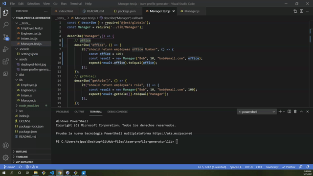
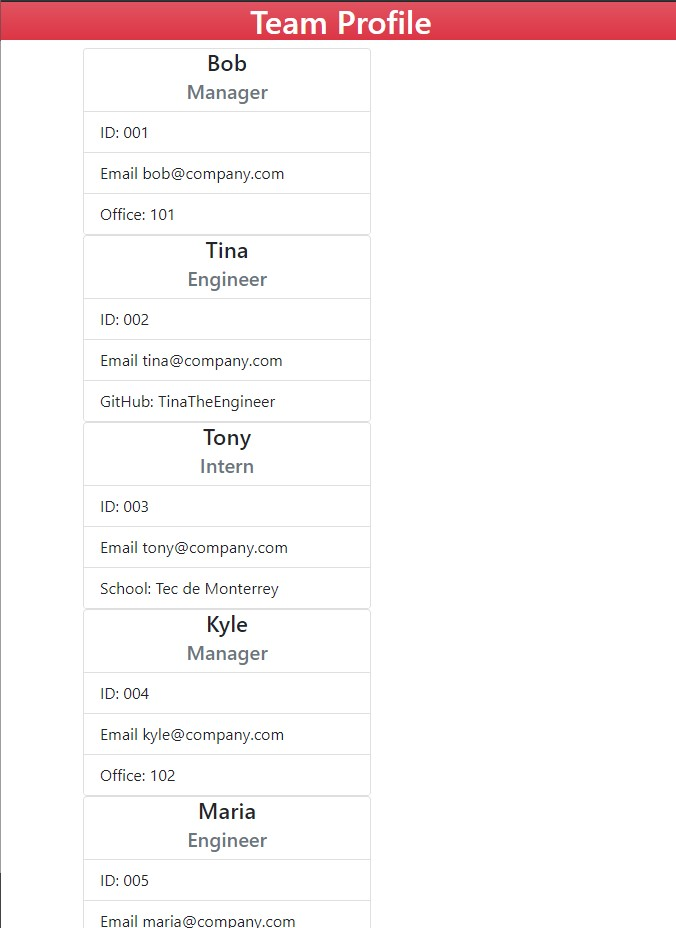

# team-profile-generator

## Description
This is a Node.js command-line application that takes in information about employees on a software engineering team, then generates an HTML webpage that displays summaries for each person. TAdditionally, a unit test was written for every part of the code,, ensuring that it passes each test.

## Testing

## Walk-through

## Mock-up
